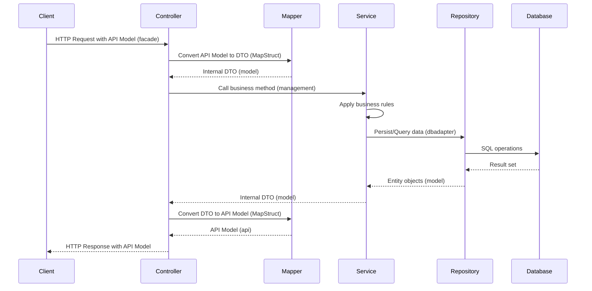
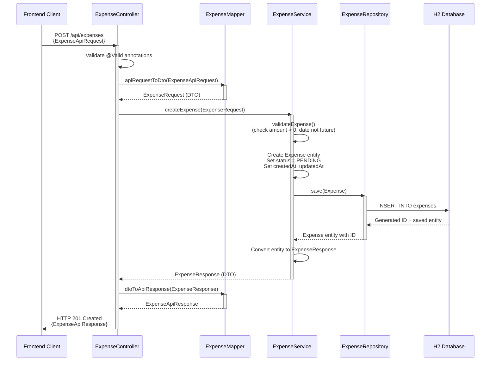

# Design Document: Expense Management System

## Overview

The Expense Management System is a Spring Boot application that provides RESTful APIs for tracking and managing financial expenses. The system follows a multi-module Maven architecture with clear separation between the API facade layer and business logic layer.

### System Architecture

The application consists of six modules with clear separation of concerns:

- **api**: OpenAPI/Swagger specification and generated API models/interfaces using openapi-generator-maven-plugin
- **model**: Contains all internal POJO classes (entities, DTOs, enums, domain models)
- **dbadapter**: Database access layer with repositories and JPA operations
- **management**: Business logic layer implementing services and validation rules
- **facade**: REST API layer implementing generated API interfaces with MapStruct for model conversion
- **standalone**: Application entry point with @SpringBootApplication class

The system uses an H2 in-memory database for data storage, providing a lightweight solution suitable for development and testing scenarios. All data is transient and resets when the application restarts.

### API Contract and Model Mapping

- **API Module**: Contains OpenAPI YAML specification. Maven plugin generates API interface classes and request/response models for frontend consumption
- **Model Module**: Contains internal DTOs used within the application
- **Facade Module**: Implements generated API interfaces and uses MapStruct to convert between API models (external) and internal DTOs
- **Conversion Flow**: Frontend API Models ↔ MapStruct Mappers ↔ Internal DTOs ↔ Services

### Key Features

- CRUD operations for expense records
- Expense categorization with predefined categories
- Multi-criteria filtering (date range, category, status)
- Expense report generation with aggregated statistics
- Comprehensive input validation with descriptive error messages
- RESTful API design following HTTP standards

## Architecture

### Module Structure

```
expense-management-system/
├── pom.xml (parent)
├── api/
│   ├── pom.xml (with openapi-generator-maven-plugin)
│   └── src/main/resources/
│       └── openapi/
│           └── expense-api.yaml
│   └── target/generated-sources/ (generated by plugin)
│       └── com/expense/api/
│           ├── model/
│           │   ├── ExpenseApiRequest.java (generated)
│           │   ├── ExpenseApiResponse.java (generated)
│           │   ├── ExpenseReportApiResponse.java (generated)
│           │   └── ErrorApiResponse.java (generated)
│           └── ExpenseApi.java (generated interface)
│               CategoryApi.java (generated interface)
│               ReportApi.java (generated interface)
├── model/
│   ├── pom.xml
│   └── src/main/java/
│       └── com/expense/model/
│           ├── entity/
│           │   └── Expense.java
│           ├── dto/
│           │   ├── ExpenseRequest.java
│           │   ├── ExpenseResponse.java
│           │   ├── ExpenseReportResponse.java
│           │   └── ErrorResponse.java
│           ├── enums/
│           │   ├── Category.java
│           │   └── Status.java
│           ├── domain/
│           │   └── ExpenseReport.java
│           └── exception/
│               ├── ExpenseNotFoundException.java
│               └── ValidationException.java
├── dbadapter/
│   ├── pom.xml
│   └── src/main/java/
│       └── com/expense/dbadapter/
│           └── repository/
│               └── ExpenseRepository.java
├── management/
│   ├── pom.xml
│   └── src/main/java/
│       └── com/expense/management/
│           └── service/
│               ├── ExpenseService.java
│               └── ReportService.java
├── facade/
│   ├── pom.xml (with mapstruct dependency)
│   └── src/main/java/
│       └── com/expense/facade/
│           ├── controller/
│           │   ├── ExpenseController.java (implements ExpenseApi)
│           │   ├── CategoryController.java (implements CategoryApi)
│           │   └── ReportController.java (implements ReportApi)
│           ├── mapper/
│           │   ├── ExpenseMapper.java (MapStruct interface)
│           │   └── ReportMapper.java (MapStruct interface)
│           └── exception/
│               └── GlobalExceptionHandler.java
└── standalone/
    ├── pom.xml
    └── src/main/java/
        └── com/expense/
            └── ExpenseManagementApplication.java
```

### Layer Responsibilities

**API Module (api)**:
- OpenAPI/Swagger YAML specification
- Maven plugin configuration for code generation
- Generated API interface classes (ExpenseApi, CategoryApi, ReportApi)
- Generated API model classes for frontend consumption
- Contract-first API design

**Model Module (model)**:
- Domain entities with JPA annotations
- Internal Data Transfer Objects (DTOs)
- Enums for categories and status values
- Domain models for business objects
- Custom exception classes

**Database Adapter Module (dbadapter)**:
- Spring Data JPA repositories
- Database query methods
- Data access layer abstraction

**Management Module (management)**:
- Business logic implementation
- Service layer orchestration
- Data validation rules
- Business rule enforcement

**Facade Module (facade)**:
- REST controllers implementing generated API interfaces
- MapStruct mappers for API model ↔ DTO conversion
- Request/response handling
- Exception mapping to HTTP status codes

**Standalone Module (standalone)**:
- Spring Boot application entry point
- Application configuration
- Component scanning configuration

### Technology Stack

- **Framework**: Spring Boot 3.x
- **Build Tool**: Maven (multi-module)
- **Database**: H2 (in-memory)
- **ORM**: Spring Data JPA
- **Validation**: Jakarta Bean Validation
- **API**: Spring Web MVC
- **API Specification**: OpenAPI 3.0 (Swagger)
- **Code Generation**: openapi-generator-maven-plugin
- **Object Mapping**: MapStruct

### Communication Flow

#### Overall System Flow



#### Create Expense Flow



#### Get Expense Flow

```mermaid
sequenceDiagram
    participant Client as Frontend Client
    participant EC as ExpenseController
    participant EM as ExpenseMapper
    participant ES as ExpenseService
    participant ER as ExpenseRepository
    participant DB as H2 Database
    
    Client->>EC: GET /api/expenses/{id}
    activate EC
    
    EC->>ES: getExpenseById(id)
    activate ES
    
    ES->>ER: findById(id)
    activate ER
    ER->>DB: SELECT * FROM expenses WHERE id = ?
    
    alt Expense exists
        DB-->>ER: Expense entity
        ER-->>ES: Optional<Expense> (present)
        deactivate ER
        
        ES->>ES: Convert entity to ExpenseResponse
        ES-->>EC: ExpenseResponse (DTO)
        deactivate ES
        
        EC->>EM: dtoToApiResponse(ExpenseResponse)
        activate EM
        EM-->>EC: ExpenseApiResponse
        deactivate EM
        
        EC-->>Client: HTTP 200 OK<br/>{ExpenseApiResponse}
    else Expense not found
        DB-->>ER: Empty result
        ER-->>ES: Optional<Expense> (empty)
        deactivate ER
        
        ES->>ES: throw ExpenseNotFoundException
        ES-->>EC: ExpenseNotFoundException
        deactivate ES
        
        EC->>EC: GlobalExceptionHandler catches
        EC-->>Client: HTTP 404 Not Found<br/>{ErrorApiResponse}
    end
    
    deactivate EC
```

#### Update Expense Flow

```mermaid
sequenceDiagram
    participant Client as Frontend Client
    participant EC as ExpenseController
    participant EM as ExpenseMapper
    participant ES as ExpenseService
    participant ER as ExpenseRepository
    participant DB as H2 Database
    
    Client->>EC: PUT /api/expenses/{id}<br/>{ExpenseApiRequest}
    activate EC
    
    EC->>EC: Validate @Valid annotations
    
    EC->>EM: apiRequestToDto(ExpenseApiRequest)
    activate EM
    EM-->>EC: ExpenseRequest (DTO)
    deactivate EM
    
    EC->>ES: updateExpense(id, ExpenseRequest)
    activate ES
    
    ES->>ER: findById(id)
    activate ER
    ER->>DB: SELECT * FROM expenses WHERE id = ?
    
    alt Expense exists
        DB-->>ER: Expense entity
        ER-->>ES: Optional<Expense> (present)
        deactivate ER
        
        ES->>ES: validateExpense()<br/>(check amount > 0, date not future)
        
        ES->>ES: Update entity fields<br/>(amount, date, category, description, status)<br/>Update updatedAt timestamp
        
        ES->>ER: save(Expense)
        activate ER
        ER->>DB: UPDATE expenses SET ... WHERE id = ?
        DB-->>ER: Updated entity
        ER-->>ES: Expense entity
        deactivate ER
        
        ES->>ES: Convert entity to ExpenseResponse
        ES-->>EC: ExpenseResponse (DTO)
        deactivate ES
        
        EC->>EM: dtoToApiResponse(ExpenseResponse)
        activate EM
        EM-->>EC: ExpenseApiResponse
        deactivate EM
        
        EC-->>Client: HTTP 200 OK<br/>{ExpenseApiResponse}
    else Expense not found
        DB-->>ER: Empty result
        ER-->>ES: Optional<Expense> (empty)
        deactivate ER
        
        ES->>ES: throw ExpenseNotFoundException
        ES-->>EC: ExpenseNotFoundException
        deactivate ES
        
        EC->>EC: GlobalExceptionHandler catches
        EC-->>Client: HTTP 404 Not Found<br/>{ErrorApiResponse}
    end
    
    deactivate EC
```

## Components and Interfaces

### API Module Components

#### OpenAPI Specification (expense-api.yaml)

The OpenAPI specification defines the contract between frontend and backend. Key endpoints:

```yaml
openapi: 3.0.0
info:
  title: Expense Management API
  version: 1.0.0
paths:
  /api/expenses:
    post:
      operationId: createExpense
      requestBody:
        content:
          application/json:
            schema:
              $ref: '#/components/schemas/ExpenseApiRequest'
      responses:
        '201':
          content:
            application/json:
              schema:
                $ref: '#/components/schemas/ExpenseApiResponse'
    get:
      operationId: getAllExpenses
      parameters:
        - name: startDate
          in: query
          schema:
            type: string
            format: date
        - name: endDate
          in: query
          schema:
            type: string
            format: date
        - name: categories
          in: query
          schema:
            type: array
            items:
              type: string
        - name: status
          in: query
          schema:
            type: string
      responses:
        '200':
          content:
            application/json:
              schema:
                type: array
                items:
                  $ref: '#/components/schemas/ExpenseApiResponse'
  /api/expenses/{id}:
    get:
      operationId: getExpenseById
      parameters:
        - name: id
          in: path
          required: true
          schema:
            type: integer
            format: int64
      responses:
        '200':
          content:
            application/json:
              schema:
                $ref: '#/components/schemas/ExpenseApiResponse'
    put:
      operationId: updateExpense
      parameters:
        - name: id
          in: path
          required: true
          schema:
            type: integer
            format: int64
      requestBody:
        content:
          application/json:
            schema:
              $ref: '#/components/schemas/ExpenseApiRequest'
      responses:
        '200':
          content:
            application/json:
              schema:
                $ref: '#/components/schemas/ExpenseApiResponse'
    delete:
      operationId: deleteExpense
      parameters:
        - name: id
          in: path
          required: true
          schema:
            type: integer
            format: int64
      responses:
        '204':
          description: No content
  /api/categories:
    get:
      operationId: getAllCategories
      responses:
        '200':
          content:
            application/json:
              schema:
                type: array
                items:
                  type: string
  /api/reports:
    get:
      operationId: generateReport
      parameters:
        - name: startDate
          in: query
          schema:
            type: string
            format: date
        - name: endDate
          in: query
          schema:
            type: string
            format: date
        - name: categories
          in: query
          schema:
            type: array
            items:
              type: string
        - name: status
          in: query
          schema:
            type: string
      responses:
        '200':
          content:
            application/json:
              schema:
                $ref: '#/components/schemas/ExpenseReportApiResponse'
components:
  schemas:
    ExpenseApiRequest:
      type: object
      required:
        - amount
        - date
        - category
        - description
      properties:
        amount:
          type: number
          format: double
        date:
          type: string
          format: date
        category:
          type: string
        description:
          type: string
        status:
          type: string
    ExpenseApiResponse:
      type: object
      properties:
        id:
          type: integer
          format: int64
        amount:
          type: number
          format: double
        date:
          type: string
          format: date
        category:
          type: string
        description:
          type: string
        status:
          type: string
        createdAt:
          type: string
          format: date-time
        updatedAt:
          type: string
          format: date-time
    ExpenseReportApiResponse:
      type: object
      properties:
        totalAmount:
          type: number
          format: double
        expenseCount:
          type: integer
          format: int64
        categorySubtotals:
          type: object
          additionalProperties:
            type: number
            format: double
        startDate:
          type: string
          format: date
        endDate:
          type: string
          format: date
        generatedAt:
          type: string
          format: date-time
    ErrorApiResponse:
      type: object
      properties:
        errorCode:
          type: string
        message:
          type: string
        details:
          type: array
          items:
            type: string
        timestamp:
          type: string
          format: date-time
```

#### Maven Plugin Configuration

The api module's pom.xml includes:

```xml
<plugin>
    <groupId>org.openapitools</groupId>
    <artifactId>openapi-generator-maven-plugin</artifactId>
    <version>7.0.1</version>
    <executions>
        <execution>
            <goals>
                <goal>generate</goal>
            </goals>
            <configuration>
                <inputSpec>${project.basedir}/src/main/resources/openapi/expense-api.yaml</inputSpec>
                <generatorName>spring</generatorName>
                <apiPackage>com.expense.api</apiPackage>
                <modelPackage>com.expense.api.model</modelPackage>
                <configOptions>
                    <interfaceOnly>true</interfaceOnly>
                    <useSpringBoot3>true</useSpringBoot3>
                    <skipDefaultInterface>true</skipDefaultInterface>
                </configOptions>
            </configuration>
        </execution>
    </executions>
</plugin>
```

Generated classes include:
- **ExpenseApi** interface with methods: createExpense, getExpenseById, getAllExpenses, updateExpense, deleteExpense
- **CategoryApi** interface with method: getAllCategories
- **ReportApi** interface with method: generateReport
- **ExpenseApiRequest**, **ExpenseApiResponse**, **ExpenseReportApiResponse**, **ErrorApiResponse** model classes

### Model Module Components

All POJO classes are defined in the model module and shared across other modules.

#### Expense Entity

The core domain entity representing a financial expense.

```java
@Entity
@Table(name = "expenses")
public class Expense {
    
    @Id
    @GeneratedValue(strategy = GenerationType.IDENTITY)
    private Long id;
    
    @Column(nullable = false, precision = 10, scale = 2)
    private BigDecimal amount;
    
    @Column(nullable = false)
    private LocalDate date;
    
    @Enumerated(EnumType.STRING)
    @Column(nullable = false, length = 50)
    private Category category;
    
    @Column(nullable = false, length = 500)
    private String description;
    
    @Enumerated(EnumType.STRING)
    @Column(nullable = false, length = 20)
    private Status status;
    
    @Column(nullable = false, updatable = false)
    private LocalDateTime createdAt;
    
    @Column(nullable = false)
    private LocalDateTime updatedAt;
    
    // Getters, setters, constructors
}
```

#### Category Enum

```java
public enum Category {
    TRAVEL,
    FOOD,
    OFFICE_SUPPLIES,
    UTILITIES,
    ENTERTAINMENT
}
```

#### Status Enum

```java
public enum Status {
    PENDING,
    APPROVED,
    REJECTED
}
```

#### DTOs (Data Transfer Objects)

**ExpenseRequest**:
```java
public class ExpenseRequest {
    
    @NotNull(message = "Amount is required")
    @Positive(message = "Amount must be positive")
    private BigDecimal amount;
    
    @NotNull(message = "Date is required")
    @PastOrPresent(message = "Date cannot be in the future")
    private LocalDate date;
    
    @NotNull(message = "Category is required")
    private String category;
    
    @NotBlank(message = "Description is required")
    @Size(max = 500, message = "Description cannot exceed 500 characters")
    private String description;
    
    private String status; // Optional for updates
    
    // Getters, setters
}
```

**ExpenseResponse**:
```java
public class ExpenseResponse {
    
    private Long id;
    private BigDecimal amount;
    private LocalDate date;
    private String category;
    private String description;
    private String status;
    private LocalDateTime createdAt;
    private LocalDateTime updatedAt;
    
    // Getters, setters
}
```

**ExpenseReportResponse**:
```java
public class ExpenseReportResponse {
    
    private BigDecimal totalAmount;
    private Long expenseCount;
    private Map<String, BigDecimal> categorySubtotals;
    private LocalDate startDate;
    private LocalDate endDate;
    private LocalDateTime generatedAt;
    
    // Getters, setters
}
```

**ErrorResponse**:
```java
public class ErrorResponse {
    
    private String errorCode;
    private String message;
    private List<String> details;
    private LocalDateTime timestamp;
    
    // Getters, setters, constructors
}
```

#### Domain Models

**ExpenseReport**:
```java
public class ExpenseReport {
    
    private BigDecimal totalAmount;
    private Long expenseCount;
    private Map<Category, BigDecimal> categorySubtotals;
    private LocalDate startDate;
    private LocalDate endDate;
    private LocalDateTime generatedAt;
    
    // Getters, setters, constructors
}
```

#### Exception Classes

**ExpenseNotFoundException**:
```java
public class ExpenseNotFoundException extends RuntimeException {
    public ExpenseNotFoundException(Long id) {
        super("Expense not found with id: " + id);
    }
}
```

**ValidationException**:
```java
public class ValidationException extends RuntimeException {
    private List<String> errors;
    
    public ValidationException(String message) {
        super(message);
    }
    
    public ValidationException(String message, List<String> errors) {
        super(message);
        this.errors = errors;
    }
    
    public List<String> getErrors() {
        return errors;
    }
}
```

### Database Adapter Module Components

#### ExpenseRepository

Data access layer using Spring Data JPA.

```java
@Repository
public interface ExpenseRepository extends JpaRepository<Expense, Long> {
    
    List<Expense> findAllByOrderByDateDesc();
    
    List<Expense> findByDateBetween(LocalDate startDate, LocalDate endDate);
    
    List<Expense> findByCategoryIn(List<Category> categories);
    
    List<Expense> findByStatus(Status status);
    
    @Query("SELECT e FROM Expense e WHERE " +
           "(:startDate IS NULL OR e.date >= :startDate) AND " +
           "(:endDate IS NULL OR e.date <= :endDate) AND " +
           "(:categories IS NULL OR e.category IN :categories) AND " +
           "(:status IS NULL OR e.status = :status) " +
           "ORDER BY e.date DESC")
    List<Expense> findByFilters(
        @Param("startDate") LocalDate startDate,
        @Param("endDate") LocalDate endDate,
        @Param("categories") List<Category> categories,
        @Param("status") Status status
    );
}
```

### Management Module Components

#### ExpenseService

Core business logic for expense management. Works with internal DTOs.

```java
@Service
public class ExpenseService {
    
    ExpenseResponse createExpense(ExpenseRequest request);
    
    ExpenseResponse getExpenseById(Long id);
    
    List<ExpenseResponse> getAllExpenses();
    
    List<ExpenseResponse> filterExpenses(
        LocalDate startDate,
        LocalDate endDate,
        List<String> categories,
        String status
    );
    
    ExpenseResponse updateExpense(Long id, ExpenseRequest request);
    
    void deleteExpense(Long id);
    
    List<String> getAllCategories();
    
    void validateExpense(ExpenseRequest request);
}
```

#### ReportService

Generates aggregated expense reports. Works with internal DTOs.

```java
@Service
public class ReportService {
    
    ExpenseReportResponse generateReport(
        LocalDate startDate,
        LocalDate endDate,
        List<String> categories,
        String status
    );
    
    Map<String, BigDecimal> calculateCategorySubtotals(List<Expense> expenses);
}
```

### Facade Module Components

#### ExpenseController

Implements the generated ExpenseApi interface and uses MapStruct for conversions.

```java
@RestController
public class ExpenseController implements ExpenseApi {
    
    private final ExpenseService expenseService;
    private final ExpenseMapper expenseMapper;
    
    @Override
    public ResponseEntity<ExpenseApiResponse> createExpense(ExpenseApiRequest request) {
        // Convert API model to internal DTO
        ExpenseRequest dto = expenseMapper.apiRequestToDto(request);
        
        // Call service
        ExpenseResponse response = expenseService.createExpense(dto);
        
        // Convert internal DTO to API model
        ExpenseApiResponse apiResponse = expenseMapper.dtoToApiResponse(response);
        
        return ResponseEntity.status(HttpStatus.CREATED).body(apiResponse);
    }
    
    @Override
    public ResponseEntity<ExpenseApiResponse> getExpenseById(Long id) {
        ExpenseResponse response = expenseService.getExpenseById(id);
        ExpenseApiResponse apiResponse = expenseMapper.dtoToApiResponse(response);
        return ResponseEntity.ok(apiResponse);
    }
    
    @Override
    public ResponseEntity<List<ExpenseApiResponse>> getAllExpenses(
        LocalDate startDate, LocalDate endDate, List<String> categories, String status) {
        
        List<ExpenseResponse> responses = expenseService.filterExpenses(
            startDate, endDate, categories, status);
        List<ExpenseApiResponse> apiResponses = expenseMapper.dtoListToApiResponseList(responses);
        return ResponseEntity.ok(apiResponses);
    }
    
    @Override
    public ResponseEntity<ExpenseApiResponse> updateExpense(Long id, ExpenseApiRequest request) {
        ExpenseRequest dto = expenseMapper.apiRequestToDto(request);
        ExpenseResponse response = expenseService.updateExpense(id, dto);
        ExpenseApiResponse apiResponse = expenseMapper.dtoToApiResponse(response);
        return ResponseEntity.ok(apiResponse);
    }
    
    @Override
    public ResponseEntity<Void> deleteExpense(Long id) {
        expenseService.deleteExpense(id);
        return ResponseEntity.noContent().build();
    }
}
```

#### CategoryController

Implements the generated CategoryApi interface.

```java
@RestController
public class CategoryController implements CategoryApi {
    
    private final ExpenseService expenseService;
    
    @Override
    public ResponseEntity<List<String>> getAllCategories() {
        List<String> categories = expenseService.getAllCategories();
        return ResponseEntity.ok(categories);
    }
}
```

#### ReportController

Implements the generated ReportApi interface with MapStruct conversion.

```java
@RestController
public class ReportController implements ReportApi {
    
    private final ReportService reportService;
    private final ReportMapper reportMapper;
    
    @Override
    public ResponseEntity<ExpenseReportApiResponse> generateReport(
        LocalDate startDate, LocalDate endDate, List<String> categories, String status) {
        
        ExpenseReportResponse response = reportService.generateReport(
            startDate, endDate, categories, status);
        ExpenseReportApiResponse apiResponse = reportMapper.dtoToApiResponse(response);
        return ResponseEntity.ok(apiResponse);
    }
}
```

#### MapStruct Mappers

**ExpenseMapper**:
```java
@Mapper(componentModel = "spring")
public interface ExpenseMapper {
    
    ExpenseRequest apiRequestToDto(ExpenseApiRequest apiRequest);
    
    ExpenseApiResponse dtoToApiResponse(ExpenseResponse dto);
    
    List<ExpenseApiResponse> dtoListToApiResponseList(List<ExpenseResponse> dtoList);
}
```

**ReportMapper**:
```java
@Mapper(componentModel = "spring")
public interface ReportMapper {
    
    ExpenseReportApiResponse dtoToApiResponse(ExpenseReportResponse dto);
}
```

MapStruct will generate implementation classes at compile time that handle the field-by-field mapping between API models and internal DTOs.

#### GlobalExceptionHandler

Centralized exception handling that converts exceptions to API error models.

```java
@RestControllerAdvice
public class GlobalExceptionHandler {
    
    @ExceptionHandler(ExpenseNotFoundException.class)
    ResponseEntity<ErrorApiResponse> handleNotFound(ExpenseNotFoundException ex);
    
    @ExceptionHandler(ValidationException.class)
    ResponseEntity<ErrorApiResponse> handleValidation(ValidationException ex);
    
    @ExceptionHandler(MethodArgumentNotValidException.class)
    ResponseEntity<ErrorApiResponse> handleMethodArgumentNotValid(MethodArgumentNotValidException ex);
    
    @ExceptionHandler(HttpMessageNotReadableException.class)
    ResponseEntity<ErrorApiResponse> handleInvalidJson(HttpMessageNotReadableException ex);
}
```

### Standalone Module Components

#### ExpenseManagementApplication

Spring Boot application entry point.

```java
@SpringBootApplication(scanBasePackages = {
    "com.expense.facade",
    "com.expense.management",
    "com.expense.dbadapter",
    "com.expense.model"
})
public class ExpenseManagementApplication {
    
    public static void main(String[] args) {
        SpringApplication.run(ExpenseManagementApplication.class, args);
    }
}
```

### Module Dependencies

The dependency hierarchy follows this structure:

```
standalone
  ├── depends on: facade
  ├── depends on: management
  ├── depends on: dbadapter
  ├── depends on: model
  └── depends on: api

facade
  ├── depends on: api (for generated interfaces and models)
  ├── depends on: management
  └── depends on: model

management
  ├── depends on: dbadapter
  └── depends on: model

dbadapter
  └── depends on: model

api
  └── (no dependencies on other modules, generates code from YAML)

model
  └── (no dependencies on other modules)
```

### MapStruct Configuration

The facade module's pom.xml includes MapStruct dependencies and annotation processor:

```xml
<dependencies>
    <dependency>
        <groupId>org.mapstruct</groupId>
        <artifactId>mapstruct</artifactId>
        <version>1.5.5.Final</version>
    </dependency>
</dependencies>

<build>
    <plugins>
        <plugin>
            <groupId>org.apache.maven.plugins</groupId>
            <artifactId>maven-compiler-plugin</artifactId>
            <configuration>
                <annotationProcessorPaths>
                    <path>
                        <groupId>org.mapstruct</groupId>
                        <artifactId>mapstruct-processor</artifactId>
                        <version>1.5.5.Final</version>
                    </path>
                </annotationProcessorPaths>
            </configuration>
        </plugin>
    </plugins>
</build>
```

## Data Models

All data models are defined in the model module and referenced throughout the application.

### Expense Entity

The core domain entity representing a financial expense.

```java
@Entity
@Table(name = "expenses")
public class Expense {
    
    @Id
    @GeneratedValue(strategy = GenerationType.IDENTITY)
    private Long id;
    
    @Column(nullable = false, precision = 10, scale = 2)
    private BigDecimal amount;
    
    @Column(nullable = false)
    private LocalDate date;
    
    @Enumerated(EnumType.STRING)
    @Column(nullable = false, length = 50)
    private Category category;
    
    @Column(nullable = false, length = 500)
    private String description;
    
    @Enumerated(EnumType.STRING)
    @Column(nullable = false, length = 20)
    private Status status;
    
    @Column(nullable = false, updatable = false)
    private LocalDateTime createdAt;
    
    @Column(nullable = false)
    private LocalDateTime updatedAt;
    
    // Getters, setters, constructors
}
```

**Constraints**:
- `amount`: Must be positive, stored with 2 decimal precision
- `date`: Cannot be in the future
- `category`: Must be one of the predefined enum values
- `status`: Must be one of Pending, Approved, or Rejected
- `createdAt`: Set automatically on creation, immutable
- `updatedAt`: Updated automatically on modification

### Database Schema

The database schema is managed by JPA/Hibernate based on entity annotations in the model module.

```sql
CREATE TABLE expenses (
    id BIGINT AUTO_INCREMENT PRIMARY KEY,
    amount DECIMAL(10, 2) NOT NULL,
    date DATE NOT NULL,
    category VARCHAR(50) NOT NULL,
    description VARCHAR(500) NOT NULL,
    status VARCHAR(20) NOT NULL,
    created_at TIMESTAMP NOT NULL,
    updated_at TIMESTAMP NOT NULL,
    CONSTRAINT chk_amount_positive CHECK (amount > 0),
    CONSTRAINT chk_date_not_future CHECK (date <= CURRENT_DATE)
);

CREATE INDEX idx_expense_date ON expenses(date);
CREATE INDEX idx_expense_category ON expenses(category);
CREATE INDEX idx_expense_status ON expenses(status);
```


## Correctness Properties

*A property is a characteristic or behavior that should hold true across all valid executions of a system—essentially, a formal statement about what the system should do. Properties serve as the bridge between human-readable specifications and machine-verifiable correctness guarantees.*

### Property Reflection

After analyzing all acceptance criteria, I identified several areas where properties can be consolidated to avoid redundancy:

- Properties about HTTP status codes (201, 200, 204, 404, 400) are combined with their corresponding functional properties rather than tested separately
- Create/retrieve round-trip is a single property that validates both creation and retrieval (covers 1.1, 1.6, 2.1)
- Update/retrieve round-trip is a single property that validates both update and retrieval (covers 3.1, 3.5)
- Delete/retrieve verification is a single property (covers 4.1, 4.3)
- Multiple filtering properties (date, category, status) share the same pattern and can reference a common filtering invariant
- Report calculation properties (total, count, subtotals) are tested together as they operate on the same data set
- Error response format is validated once across all error scenarios rather than per error type

### Property 1: Expense Creation Round-Trip

*For any* valid expense data (positive amount, non-future date, valid category, non-empty description), creating an expense and then retrieving it by ID should return an expense with the same data, a unique identifier, status set to Pending, and HTTP status 201 on creation.

**Validates: Requirements 1.1, 1.5, 1.6, 2.1**

### Property 2: Required Fields Validation

*For any* expense creation request missing one or more required fields (amount, date, category, description), the system should reject the request with HTTP status 400 and list the missing fields in the error response.

**Validates: Requirements 1.2, 10.2**

### Property 3: Negative Amount Rejection

*For any* expense creation or update request with a negative amount, the system should reject the request with a validation error and HTTP status 400.

**Validates: Requirements 1.3, 3.3**

### Property 4: Future Date Rejection

*For any* expense creation request with a date in the future, the system should reject the request with a validation error and HTTP status 400.

**Validates: Requirements 1.4**

### Property 5: Non-Existent Expense Returns 404

*For any* non-existent expense ID, retrieval, update, or delete operations should return HTTP status 404.

**Validates: Requirements 2.2, 3.4, 4.2**

### Property 6: Retrieve All Returns Complete Set

*For any* set of created expenses, retrieving all expenses should return exactly that set with no additions or omissions.

**Validates: Requirements 2.3**

### Property 7: Date Descending Order Invariant

*For any* set of expenses with different dates, retrieving all expenses should return them ordered by date in descending order (newest first).

**Validates: Requirements 2.4**

### Property 8: Expense Update Round-Trip

*For any* existing expense and valid update data, updating the expense and then retrieving it should return the expense with the updated values and HTTP status 200 on update.

**Validates: Requirements 3.1, 3.2, 3.5**

### Property 9: Delete Removes Expense

*For any* existing expense, deleting it should result in the expense no longer being retrievable (404 on subsequent GET) and return HTTP status 204 on successful deletion.

**Validates: Requirements 4.1, 4.3**

### Property 10: Invalid Category Rejection

*For any* expense creation, update, or filter request with a category value not in {TRAVEL, FOOD, OFFICE_SUPPLIES, UTILITIES, ENTERTAINMENT}, the system should reject the request with HTTP status 400.

**Validates: Requirements 5.2, 7.3**

### Property 11: Category Filter Correctness

*For any* set of expenses and any valid category, filtering by that category should return only expenses where the category field matches the filter value.

**Validates: Requirements 5.4, 7.1**

### Property 12: Multi-Category Filter Correctness

*For any* set of expenses and any list of valid categories, filtering by those categories should return only expenses where the category field matches at least one of the filter values.

**Validates: Requirements 7.2**

### Property 13: Date Range Filter Inclusivity

*For any* set of expenses and any date range (start and end dates), filtering by that range should return only expenses where the date is greater than or equal to start date AND less than or equal to end date.

**Validates: Requirements 6.1**

### Property 14: Start Date Only Filter

*For any* set of expenses and any start date, filtering with only a start date should return only expenses where the date is greater than or equal to the start date.

**Validates: Requirements 6.2**

### Property 15: End Date Only Filter

*For any* set of expenses and any end date, filtering with only an end date should return only expenses where the date is less than or equal to the end date.

**Validates: Requirements 6.3**

### Property 16: Invalid Date Range Rejection

*For any* date range where the end date is before the start date, the system should reject the filter request with HTTP status 400.

**Validates: Requirements 6.4**

### Property 17: Status Filter Correctness

*For any* set of expenses and any valid status value {PENDING, APPROVED, REJECTED}, filtering by that status should return only expenses where the status field matches the filter value.

**Validates: Requirements 8.1**

### Property 18: Invalid Status Rejection

*For any* filter or update request with a status value not in {PENDING, APPROVED, REJECTED}, the system should reject the request with HTTP status 400.

**Validates: Requirements 8.3**

### Property 19: Report Total Calculation

*For any* set of expenses (optionally filtered), generating a report should calculate the total amount as the sum of all matching expense amounts.

**Validates: Requirements 9.1**

### Property 20: Report Count Calculation

*For any* set of expenses (optionally filtered), generating a report should calculate the expense count as the number of matching expenses.

**Validates: Requirements 9.2**

### Property 21: Report Category Subtotals

*For any* set of expenses (optionally filtered), generating a report should group expenses by category and calculate subtotals where each category's subtotal equals the sum of amounts for expenses in that category.

**Validates: Requirements 9.3**

### Property 22: Report Respects Filters

*For any* set of expenses and any combination of filters (date range, category, status), generating a report with those filters should include only expenses matching all specified filter criteria in the calculations.

**Validates: Requirements 9.4**

### Property 23: Report Returns 200

*For any* report request (with or without filters), the system should return the report with HTTP status 200.

**Validates: Requirements 9.5**

### Property 24: Invalid JSON Rejection

*For any* malformed JSON request body, the system should return HTTP status 400 with a descriptive error message.

**Validates: Requirements 10.1**

### Property 25: Invalid Data Type Rejection

*For any* request with fields containing invalid data types (e.g., string for amount, number for description), the system should return HTTP status 400 with field-specific error messages.

**Validates: Requirements 10.3**

### Property 26: Error Response Format Consistency

*For any* error condition that returns 400, 404, or 500 status codes, the error response should be in JSON format containing errorCode, message, details (optional), and timestamp fields.

**Validates: Requirements 10.4**

### Property 27: Persistence Round-Trip

*For any* sequence of create, update, and delete operations, the database state should reflect all operations such that subsequent queries return data consistent with the operations performed.

**Validates: Requirements 11.3**

### Property 28: JSON Content Negotiation

*For any* valid API request with Content-Type application/json, the system should accept the request and return a response with Content-Type application/json.

**Validates: Requirements 12.8**

## Error Handling

### Error Categories

The system implements comprehensive error handling across multiple categories:

#### Validation Errors (HTTP 400)

- **Missing Required Fields**: When expense creation/update requests omit required fields
- **Invalid Data Types**: When request fields contain wrong data types
- **Business Rule Violations**: 
  - Negative amounts
  - Future dates
  - Invalid categories
  - Invalid status values
  - Invalid date ranges (end before start)
- **Malformed JSON**: When request body cannot be parsed

#### Not Found Errors (HTTP 404)

- **Non-Existent Expense**: When operations reference expense IDs that don't exist in the database

#### Server Errors (HTTP 500)

- **Database Errors**: When database operations fail unexpectedly
- **Unexpected Exceptions**: When unhandled exceptions occur during processing

### Error Response Structure

All errors return a consistent JSON structure:

```json
{
  "errorCode": "VALIDATION_ERROR",
  "message": "Validation failed for expense creation",
  "details": [
    "Amount must be positive",
    "Date cannot be in the future"
  ],
  "timestamp": "2024-01-15T10:30:00Z"
}
```

### Error Codes

- `VALIDATION_ERROR`: Input validation failures
- `NOT_FOUND`: Resource not found
- `INVALID_JSON`: Malformed JSON in request body
- `INVALID_DATE_RANGE`: End date before start date
- `INTERNAL_ERROR`: Unexpected server errors

### Exception Handling Strategy

**Controller Layer**:
- Catches framework exceptions (MethodArgumentNotValidException, HttpMessageNotReadableException)
- Delegates business exceptions to GlobalExceptionHandler
- Never exposes internal implementation details in error messages

**Service Layer**:
- Throws domain-specific exceptions (ValidationException, ExpenseNotFoundException)
- Validates business rules before database operations
- Provides detailed error context for meaningful error messages

**Repository Layer**:
- Allows JPA exceptions to propagate
- Relies on service layer to handle Optional results
- Database constraint violations are caught and translated to ValidationException

### Validation Strategy

**DTO Level Validation**:
- Jakarta Bean Validation annotations (@NotNull, @Positive, @PastOrPresent, etc.)
- Automatic validation via @Valid annotation in controllers
- Provides field-level error messages

**Service Level Validation**:
- Business rule validation (category enum values, status enum values)
- Cross-field validation (date range logic)
- Database constraint validation (unique identifiers)

**Database Level Constraints**:
- NOT NULL constraints on required fields
- CHECK constraints for positive amounts and non-future dates
- Enum validation through JPA @Enumerated

## Testing Strategy

### Dual Testing Approach

The system requires both unit testing and property-based testing for comprehensive coverage:

- **Unit Tests**: Verify specific examples, edge cases, and integration points
- **Property Tests**: Verify universal properties across randomized inputs

### Unit Testing

**Scope**: Focus on specific scenarios and edge cases

**Test Categories**:

1. **Controller Layer Tests**
   - Endpoint routing and HTTP method mapping
   - Request/response DTO transformation
   - Exception handler mappings
   - Specific examples: creating expense with exact values, retrieving by known ID

2. **Service Layer Tests**
   - Business logic for specific scenarios
   - Edge cases: empty database, single expense, boundary dates
   - Integration with repository layer
   - Transaction behavior

3. **Repository Layer Tests**
   - Custom query methods with specific data sets
   - JPA entity mapping
   - Database constraint enforcement

4. **Integration Tests**
   - Full request/response cycle for specific scenarios
   - Database initialization and cleanup
   - Error response format verification

**Example Unit Tests**:
- Create expense with Travel category and verify it's stored
- Retrieve non-existent expense ID 999 and verify 404 response
- Update expense status from Pending to Approved
- Delete expense and verify 204 response
- Filter expenses for January 2024 date range
- Generate report with no expenses and verify zero totals

**Tools**: JUnit 5, Mockito, Spring Boot Test, MockMvc, H2 test database

### Property-Based Testing

**Scope**: Verify universal properties across all possible inputs

**Configuration**:
- Minimum 100 iterations per property test
- Use jqwik library for Java property-based testing
- Each test references its design document property via comment tag

**Tag Format**:
```java
// Feature: expense-management-system, Property 1: Expense Creation Round-Trip
```

**Property Test Categories**:

1. **Round-Trip Properties**
   - Create/retrieve (Property 1)
   - Update/retrieve (Property 8)
   - Delete/verify absence (Property 9)
   - Persistence operations (Property 27)

2. **Validation Properties**
   - Required fields (Property 2)
   - Negative amounts (Property 3)
   - Future dates (Property 4)
   - Invalid categories (Property 10)
   - Invalid status values (Property 18)
   - Invalid date ranges (Property 16)

3. **Filtering Properties**
   - Category filters (Properties 11, 12)
   - Date range filters (Properties 13, 14, 15)
   - Status filters (Property 17)
   - Combined filters (Property 22)

4. **Invariant Properties**
   - Date ordering (Property 7)
   - Complete set retrieval (Property 6)
   - Error response format (Property 26)

5. **Calculation Properties**
   - Report totals (Property 19)
   - Report counts (Property 20)
   - Category subtotals (Property 21)

**Generators**:

Custom jqwik generators for:
- Valid expenses (positive amounts, past/present dates, valid categories)
- Invalid expenses (negative amounts, future dates, invalid categories)
- Date ranges (valid and invalid)
- Filter combinations
- Expense lists of varying sizes

**Example Property Test**:
```java
// Feature: expense-management-system, Property 1: Expense Creation Round-Trip
@Property
void expenseCreationRoundTrip(@ForAll("validExpenses") Expense expense) {
    // Create expense
    ExpenseResponse created = expenseController.createExpense(toRequest(expense));
    assertThat(created.getId()).isNotNull();
    assertThat(created.getStatus()).isEqualTo("PENDING");
    
    // Retrieve and verify
    ExpenseResponse retrieved = expenseController.getExpense(created.getId());
    assertThat(retrieved).isEqualToIgnoringGivenFields(created, "createdAt", "updatedAt");
}

@Provide
Arbitrary<Expense> validExpenses() {
    return Combinators.combine(
        Arbitraries.bigDecimals().between(BigDecimal.valueOf(0.01), BigDecimal.valueOf(10000)),
        Arbitraries.dates().atTheEarliest(LocalDate.of(2020, 1, 1)).atTheLatest(LocalDate.now()),
        Arbitraries.of(Category.class),
        Arbitraries.strings().alpha().ofMinLength(1).ofMaxLength(500)
    ).as((amount, date, category, description) -> 
        new Expense(null, amount, date, category, description, null, null, null)
    );
}
```

**Tools**: jqwik (property-based testing for Java), JUnit 5 Platform

### Test Coverage Goals

- **Line Coverage**: Minimum 80%
- **Branch Coverage**: Minimum 75%
- **Property Coverage**: 100% of design document properties implemented
- **Critical Path Coverage**: 100% (CRUD operations, filtering, reporting)

### Continuous Integration

- All tests run on every commit
- Property tests run with 100 iterations in CI
- Failed property tests report the failing input for reproduction
- Integration tests use isolated H2 instances
- Test database is reset between test classes
